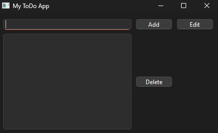

# 📝 My To-Do App

Une simple **To-Do List** développée pour m'entraîner avec Python et PySide6

## 📸 Aperçu


## 🚀 Fonctionnalités
- ✅ Ajouter une tâche
- ✏️ Modifier une tâche
- ❌ Supprimer une tâche

## 🛠 Technologies utilisées
- Python
- PySide6

## 📦 Installation
1. **Cloner le dépôt** :
   ```bash
   git clone https://github.com/ImadKent/ToDoApp.git
   cd ToDoApp

2. **Installer les dépendances**

pip install -r requirements.txt

3. **Lancer l'application :**

    python main.py

🎯 Objectif

Ce projet a été créé uniquement pour l'apprentissage et l'expérimentation. Rien de fou, mais utile pour comprendre PySide6. 😁
